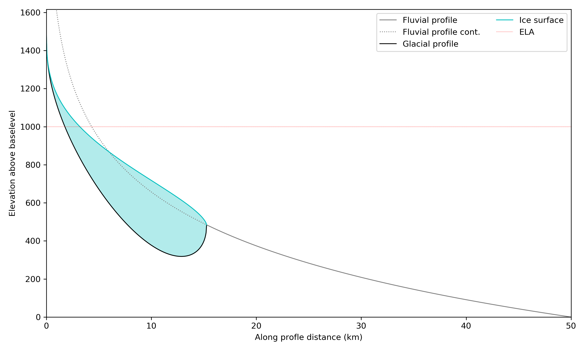
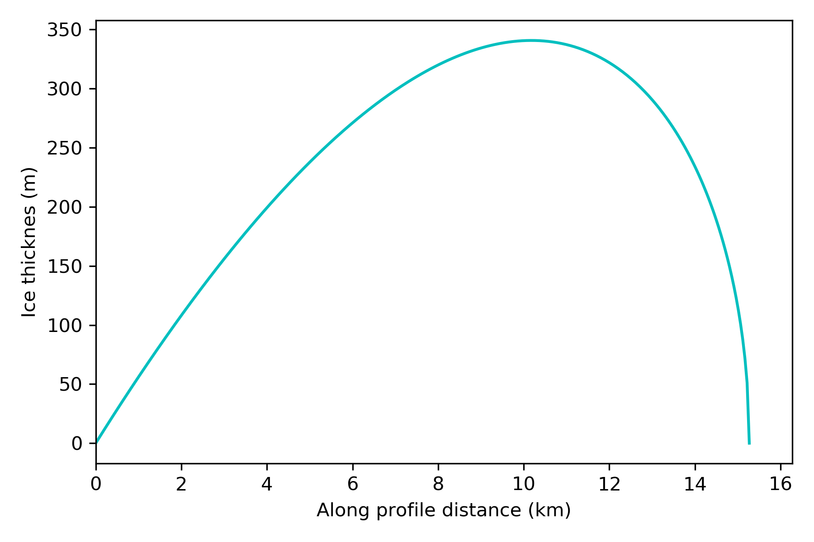

__Analytical glacio-fluvial steady-state profiles__

The code provided calculates the steady-state profile described in the paper, 'The Sliding Ice Incision Model: A new approach to understanding glacial landscape evolution' be Eric Deal and Guenther Prasicek. The code solves for the bedrock profile elevation according to z(x) = h(x) - H(x)  if x < x<sub>t</sub> and z(x) = k<sub>s</sub> ln(L/x) if x > x<sub>t</sub>.

h(x) is the ice surface elevation,

h(x) =  k<sub>s</sub> ln(x<sub>t</sub>/L) + c<sub>s</sub>x<sub>t</sub><sup>r</sup>I<sub>(1-x/x_t)</sub>(c<sub>1</sub>,c<sub>2</sub>),

and H(x) is the ice thickness,

H = c<sub>p</sub>(c<sub>e</sub>/U)<sup>&gamma;/&ell;</sup>q<sub>g</sub><sup>&gamma;</sup>.

The various parameters are described in the paper.

The model is set up as a class,
```PYTHON
class glacial_profile_model(object):
```
This class can easily be used to create model objects with defined parameter values,
```PYTHON
gp = glacial_profile_model()
```
There is a default parameter set, but many parameters can also be passed as the model object is created, including uplift rate, ELA, rainfall rate P, as well as fluvial and glacial erodibility coefficients and exponents.
```PYTHON
gp = glacial_profile_model(U=1e-3, ELA=1000, P=3, delta=3e-3, plot=True)
```
Other parameter values can be changed directly in the class definition is required.

The model will automatically choose whether to solve for a purely fluvial, mixed glacio-fluvial or purely glacial profile based on the given parameters. If the keyword `plot=True`, the profile will be plotted with the ELA and ice thickness shown:




The model object can then be queried for information about itself, and used to make other plots for example:
```PYTHON
plt.plot(gp.xg/1e3, gp.H(gp.xg), 'c', label='Ice thickness')
plt.xlim(0, gp.xt/1e3 + 1)
plt.xlabel('Along profile distance (km)')
plt.ylabel('Ice thicknes (m)')
```
which yields a plot of the ice thickness along the profile:


